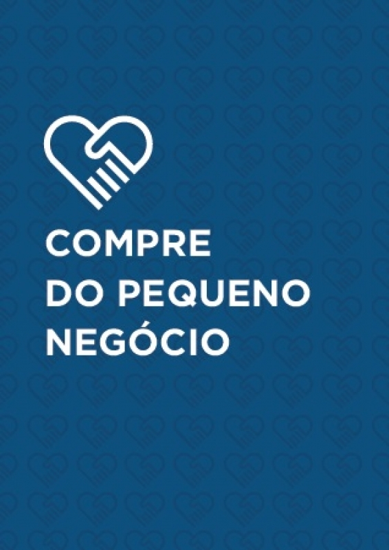

# Valorize O Pequeno Negócio

Para incentivar o comercio local temos a incrivel opção de criar serviços temporarios e gratuitos para demonstração do impacto em tempo real da tecnologia no negocio de pequeno porte.
Seguindo o movimento do Sebrae .

A Asterix Soluções esta disponibilizando um treinamento completo ("mão na massa") com todos os passos para qualquer pessoa incluir um negócio de pequeno a medio porte à internet.  
*Comprar do pequeno negócio faz o dinheiro circular pelo bairro, o que propicia mais desenvolvimento local. Esse consumo afeta até o 
trânsito, já que produz menos deslocamentos pela cidade, além de contribuir para o meio ambiente, com a redução da emissão dos gases poluentes de carros e ônibus.* Fonte: [Sebrae](https://www.sebrae.com.br/sites/PortalSebrae/sebraeaz/movimento-compre-do-pequeno-negocio-busca-fortalecer-comercio-local,03b1aee47d1be410VgnVCM1000003b74010aRCRD)  
Além de ajudar no controle da Pandemia do COVID-19 "Corona Virus" devido a limitação da circulação local.

